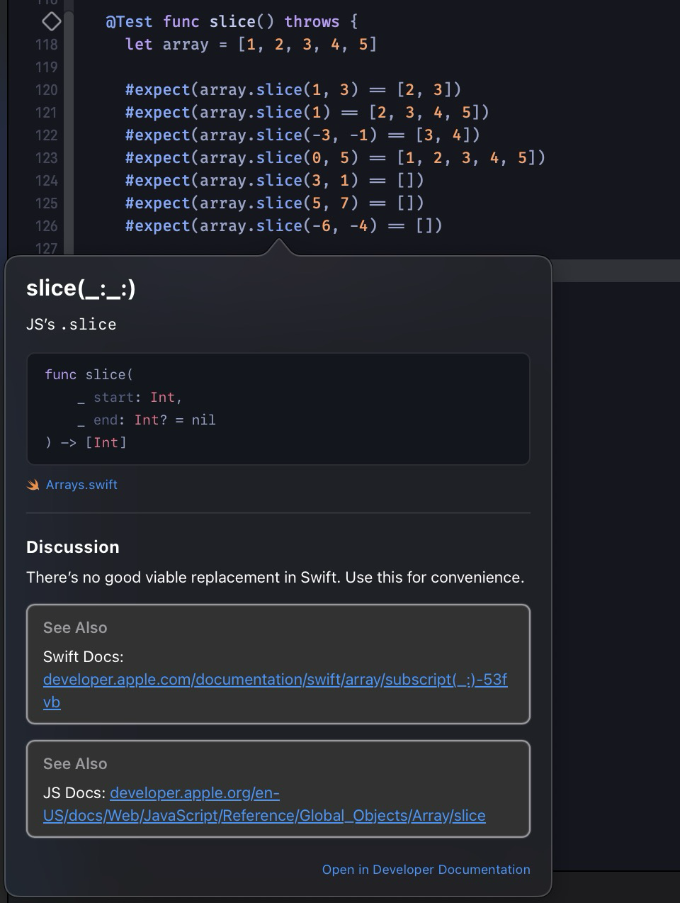
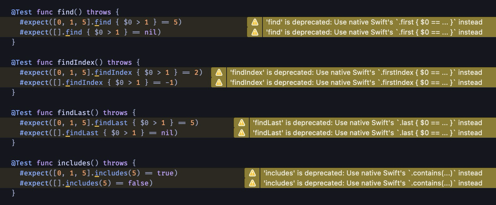

<p align="center">
  <a href="https://mesqueeb.github.io/SwiftVsTypeScript/justSugar">
    
  </a>
</p>

# JustSugar 🍰

[](https://swiftpackageindex.com/mesqueeb/JustSugar)
[](https://swiftpackageindex.com/mesqueeb/JustSugar)

```
.package(url: "https://github.com/mesqueeb/JustSugar", from: "0.2.3")
```

JS-inspired Syntax Sugar on top of Swift to do two things:
1. Adds useful Array and String methods inspired by JS like `.at`, `.slice`, `.join`, etc.
2. Adds all the most common JS Array and String methods to Swift, with deprecation warnings where Swift has an alternative that is just as good.
  - In this case we want to prefer the Swift method, so a deprecation warning is shown when reaching for the JS method. This is perfect for new Swift developers coming from JavaScript or TypeScript.

**Example of the .slice method**



**Example of JS methods with deprecation warning prompting to use the Swift equivalent**



## Full Documentation

See the SPM [JustSugar documentation](https://swiftpackageindex.com/mesqueeb/justsugar/documentation/justsugar/swift) for more info.

## TypeScript VS Swift Cheatsheet

See [mesqueeb.github.io/SwiftVsTypeScript](https://mesqueeb.github.io/SwiftVsTypeScript/) for a cheatsheet comparing Swift and TypeScript.
